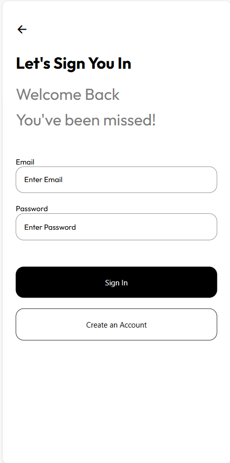
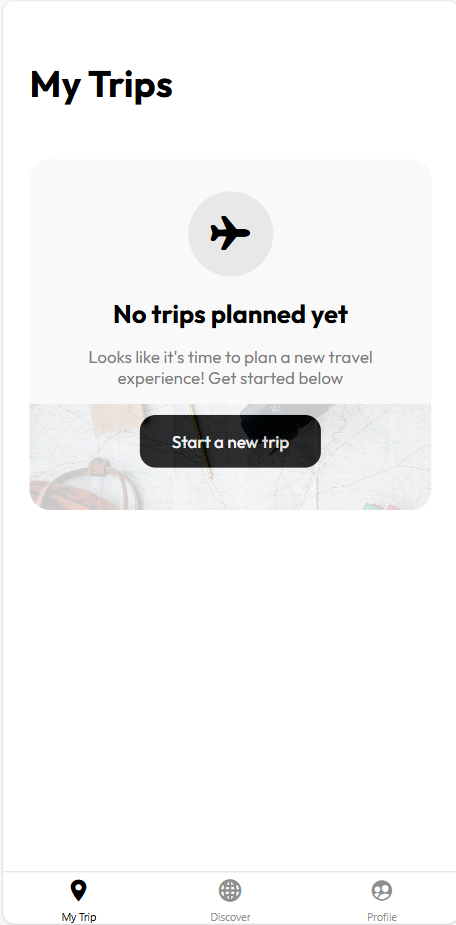

# AI Travel App 🌍✈️


AI Travel App is a modern mobile application that leverages artificial intelligence to provide personalized travel recommendations and trip planning. Built with React Native and Expo, it helps travelers discover destinations, create detailed itineraries, and manage their trips—all enhanced by Google's Gemini AI.

## ✨ Features

- **AI-Powered Recommendations**: Get personalized destination suggestions based on your interests, budget, and travel preferences
- **Detailed Trip Planning**: View comprehensive trip plans including daily activities, must-see attractions, and local tips
- **Trip Management**: Save, organize, and access your trips anytime
- **User Authentication**: Secure account creation and login with Firebase
- **Budget Estimates**: Get cost estimates for your trips to help with financial planning
- **Offline Access**: View your saved trips even without an internet connection

## 📱 Screenshots

<table>
  <tr>
    <td></td>
    <td></td>
  </tr>
  <tr>
    <td align="center">Sign In Screen</td>
    <td align="center">My Trip Screen</td>
  </tr>
</table>

## 🚀 Installation

### Prerequisites

- Node.js (v14 or newer)
- npm or yarn
- Expo CLI (`npm install -g expo-cli`)

### Setup

1. Clone the repository
   ```bash
   git clone https://github.com/yourusername/ai-travel-app.git
   cd ai-travel-app
   ```

2. Install dependencies
   ```bash
   npm install
   ```

3. Set up environment variables

   Create a `.env` file in the root directory with the following variables:
   ```
   EXPO_PUBLIC_GEMINI_API_KEY=YOUR_GEMINI_API_KEY_HERE
   ```

4. Start the development server
   ```bash
   npx expo start
   ```

## 📖 Usage

1. **Sign Up/Login**: Create an account or log in to access all features
2. **Discover**: Browse AI-recommended destinations based on your preferences
3. **Create Trip**: Select a destination and get AI-generated trip plans
4. **My Trips**: View and manage your saved trips
5. **Trip Details**: Access comprehensive information about each destination

## 🛠️ Technologies Used

- **Frontend**: React Native, Expo
- **Navigation**: Expo Router (file-based routing)
- **State Management**: React Context API
- **Authentication & Database**: Firebase (Authentication, Firestore)
- **AI Integration**: Google Gemini AI
- **Location Services**: Google Places API

## 🤝 Contributing

Contributions are welcome! Please feel free to submit a Pull Request.

1. Fork the repository
2. Create your feature branch (`git checkout -b feature/amazing-feature`)
3. Commit your changes (`git commit -m 'Add some amazing feature'`)
4. Push to the branch (`git push origin feature/amazing-feature`)
5. Open a Pull Request

## 📄 License

This project is licensed under the MIT License - see the [LICENSE](LICENSE) file for details.

## 🙏 Acknowledgements

- [Expo](https://expo.dev/) for the amazing development platform
- [Firebase](https://firebase.google.com/) for authentication and database services
- [Google Gemini AI](https://ai.google.dev/) for powering the AI recommendations
- [React Native](https://reactnative.dev/) for the mobile framework
